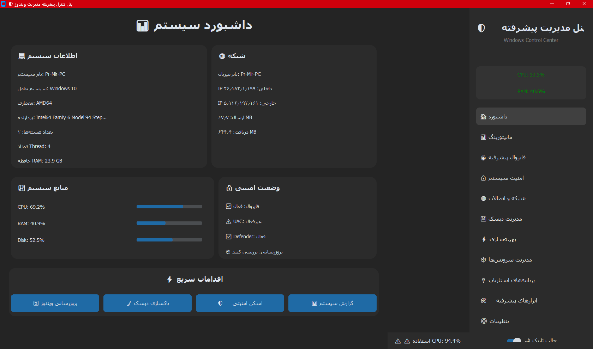
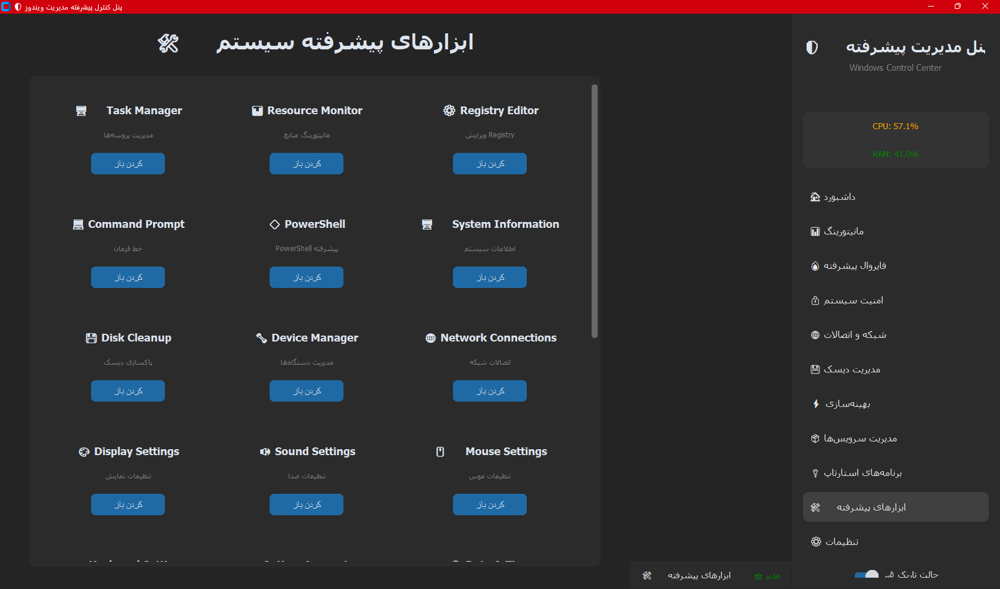

# 🛡️ پنل کنترل پیشرفته مدیریت ویندوز

<div align="center">


**ابزار جامع و حرفه‌ای برای مدیریت، مانیتورینگ و بهینه‌سازی سیستم‌های ویندوز**

[ویژگی‌ها](#-ویژگی‌ها) • [نصب](#-نصب-و-راه‌اندازی) • [استفاده](#-نحوه-استفاده) • [اسکرین‌شات‌ها](#-اسکرین‌شات‌ها) • [مستندات](#-مستندات)

</div>

---

## 📋 فهرست مطالب

- [درباره پروژه](#-درباره-پروژه)
- [ویژگی‌ها](#-ویژگی‌ها)
- [پیش‌نیازها](#-پیش‌نیازها)
- [نصب و راه‌اندازی](#-نصب-و-راه‌اندازی)
- [نحوه استفاده](#-نحوه-استفاده)
- [بخش‌های برنامه](#-بخش‌های-برنامه)
- [تنظیمات](#-تنظیمات)
- [عیب‌یابی](#-عیب‌یابی)
- [مشارکت](#-مشارکت)
- [لایسنس](#-لایسنس)

---

## 🎯 درباره پروژه

**پنل کنترل پیشرفته مدیریت ویندوز** یک ابزار قدرتمند و کاربرپسند برای مدیران شبکه، تکنسین‌های IT و کاربران پیشرفته ویندوز است که امکانات گسترده‌ای برای:

- 🔍 مانیتورینگ لحظه‌ای منابع سیستم
- 🔥 مدیریت پیشرفته فایروال
- 🔒 تقویت امنیت سیستم
- 🌐 مدیریت شبکه و اتصالات
- ⚡ بهینه‌سازی و افزایش سرعت
- 💾 مدیریت دیسک و فضای ذخیره‌سازی
- 📦 کنترل سرویس‌ها و برنامه‌های استارتاپ

را فراهم می‌کند.

---

## ✨ ویژگی‌ها

### 📊 داشبورد هوشمند
- نمایش اطلاعات کلیدی سیستم در یک نگاه
- کارت‌های اطلاعاتی تعاملی
- دسترسی سریع به اقدامات متداول
- نمایش وضعیت امنیتی فوری

### 📈 مانیتورینگ لحظه‌ای
- **نمودارهای زنده:** نمایش گرافیکی CPU و RAM
- **هشدارهای هوشمند:** اعلان خودکار هنگام استفاده بالای منابع
- **تاریخچه:** ذخیره 60 ثانیه آخر داده‌ها
- **اطلاعات تفصیلی:** جزئیات هر هسته CPU

### 🔥 مدیریت پیشرفته فایروال
- فعال/غیرفعال کردن فایروال
- مدیریت قوانین ورودی و خروجی
- افزودن قوانین سفارشی با تنظیمات کامل
- نمایش تمام قوانین فعال

### 🔒 امنیت سیستم
- **Windows Defender:**
  - اسکن سریع و کامل
  - بروزرسانی خودکار تعاریف
  - مدیریت استثناهای اسکن
- **UAC:** تنظیم 4 سطح امنیتی
- **بررسی آسیب‌پذیری:** شناسایی نقاط ضعف امنیتی
- **مانیتورینگ پورت‌ها:** بررسی پورت‌های باز

### 🌐 شبکه و اتصالات
- **اطلاعات کامل شبکه:** ipconfig, آداپترها
- **ابزارهای شبکه:**
  - Ping
  - Traceroute
  - DNS Lookup
  - Flush DNS
  - Reset Network
- **تنظیمات DNS:** پیش‌فرض‌های آماده (Google, Cloudflare, Shecan, 403)
- **نمایش اتصالات فعال:** netstat با جزئیات

### 💾 مدیریت دیسک
- نمایش گرافیکی فضای تمام دیسک‌ها
- تحلیل فضای پوشه‌ها
- شناسایی بزرگ‌ترین پوشه‌ها
- پاکسازی خودکار فایل‌های موقت
- دسترسی مستقیم به Disk Management

### ⚡ بهینه‌سازی سیستم
- **پاکسازی فایل‌های موقت:** حذف خودکار Temp, Cache
- **بهینه‌سازی حافظه:** آزادسازی RAM
- **مدیریت استارتاپ:** غیرفعال‌سازی برنامه‌های اضافی
- **غیرفعال‌سازی سرویس‌ها:** متوقف کردن سرویس‌های غیرضروری
- **بهینه‌سازی جلوه‌های بصری:** افزایش سرعت
- **بهینه‌سازی شبکه:** تنظیمات TCP/IP
- **بهینه‌سازی کامل:** اجرای تمام موارد با یک کلیک

### 📦 مدیریت سرویس‌ها
- لیست تمام سرویس‌های ویندوز
- نمایش وضعیت هر سرویس
- جستجو در سرویس‌ها
- دسترسی مستقیم به Services.msc

### 🔌 برنامه‌های استارتاپ
- نمایش برنامه‌های استارتاپ از Registry
- نمایش فایل‌های Startup Folder
- دسترسی مستقیم به Task Manager
- باز کردن پوشه Startup

### 🛠️ ابزارهای پیشرفته (22 ابزار)
- Task Manager
- Resource Monitor
- Registry Editor
- Command Prompt
- PowerShell
- System Information
- Device Manager
- Network Connections
- Event Viewer
- و 13 ابزار دیگر...

### 📊 گزارش‌دهی
- تولید گزارش کامل سیستم
- شامل اطلاعات سیستم، شبکه، منابع و امنیت
- ذخیره گزارش در فایل TXT
- قالب‌بندی خوانا و ساختاریافته

### ⚙️ تنظیمات
- تنظیم آستانه هشدارها (CPU, Memory)
- انتخاب تم (روشن/تاریک)
- ذخیره خودکار تنظیمات
- بازگردانی به تنظیمات پیش‌فرض

---

## 🔧 پیش‌نیازها

### سیستم عامل
- ✅ Windows 10 (1809 یا جدیدتر)
- ✅ Windows 11
- ✅ Windows Server 2019/2022

### نرم‌افزار
- **Python:** نسخه 3.8 یا بالاتر
- **pip:** برای نصب پکیج‌ها
- **دسترسی مدیر (Administrator):** برای برخی عملیات

### سخت‌افزار توصیه‌شده
- **CPU:** 2 هسته یا بیشتر
- **RAM:** حداقل 4GB
- **فضای دیسک:** 100MB فضای خالی
- **نمایشگر:** حداقل 1280x720

---

## 📥 نصب و راه‌اندازی

### گام 1: دانلود Python

اگر Python نصب نیست، از لینک زیر دانلود کنید:

🔗 [دانلود Python](https://www.python.org/downloads/)

**نکته مهم:** حتماً گزینه "Add Python to PATH" را هنگام نصب فعال کنید.

### گام 2: دانلود پروژه

```bash
# با Git
git clone https://github.com/Scary-technologies/Microsoft-Windows-User-Manager.git
cd windows-control-panel

# یا دانلود ZIP و استخراج آن
```

### گام 3: نصب کتابخانه‌ها

```bash
pip install -r requirements.txt
```

### گام 4: اجرای برنامه

**روش 1: اجرا با دسترسی عادی**
```bash
python windows_control_panel.py
```

**روش 2: اجرا با دسترسی مدیر (توصیه می‌شود)**
```bash
# روی فایل راست کلیک کنید و "Run as administrator" را انتخاب کنید
```

یا از PowerShell:
```powershell
Start-Process python -ArgumentList "windows_control_panel.py" -Verb RunAs
```

### گام 5: ایجاد Shortcut (اختیاری)

1. روی `windows_control_panel.py` راست کلیک کنید
2. "Create shortcut" را انتخاب کنید
3. روی Shortcut راست کلیک > Properties
4. در فیلد Target، قبل از مسیر فایل، مسیر Python را اضافه کنید:
   ```
   "C:\Path\To\Python\python.exe" "C:\Path\To\windows_control_panel.py"
   ```
5. روی دکمه "Advanced" کلیک کنید
6. گزینه "Run as administrator" را فعال کنید

---

## 🚀 نحوه استفاده

### راه‌اندازی اولیه

1. **اجرای برنامه:** برنامه را با دسترسی مدیر اجرا کنید
2. **بررسی داشبورد:** اطلاعات اولیه سیستم را مشاهده کنید
3. **پیکربندی تنظیمات:** به بخش تنظیمات بروید و آستانه‌های هشدار را تنظیم کنید

### استفاده روزانه

#### مانیتورینگ سیستم
1. به بخش "مانیتورینگ" بروید
2. نمودارهای CPU و RAM را مشاهده کنید
3. در صورت نیاز، دکمه "بروزرسانی نمودار" را بزنید

#### بهینه‌سازی سریع
1. به بخش "بهینه‌سازی" بروید
2. دکمه "بهینه‌سازی کامل" را بزنید
3. منتظر اتمام عملیات بمانید
4. سیستم را ری‌استارت کنید

#### بررسی امنیت
1. به بخش "امنیت سیستم" بروید
2. تب "بررسی آسیب‌پذیری" را انتخاب کنید
3. دکمه "شروع بررسی" را بزنید
4. نتایج را مطالعه کنید و اقدامات لازم را انجام دهید

#### تنظیم فایروال
1. به بخش "فایروال پیشرفته" بروید
2. برای افزودن قانون، به تب "قوانین سفارشی" بروید
3. فرم را پر کنید و "افزودن قانون" را بزنید

---

## 📚 بخش‌های برنامه

### 1️⃣ داشبورد
- نمای کلی سیستم
- اطلاعات سخت‌افزار و شبکه
- وضعیت امنیتی
- اقدامات سریع

### 2️⃣ مانیتورینگ
- نمودارهای زنده
- اطلاعات تفصیلی CPU
- استفاده حافظه
- تاریخچه منابع

### 3️⃣ فایروال پیشرفته
- کنترل فایروال
- قوانین ورودی/خروجی
- قوانین سفارشی

### 4️⃣ امنیت سیستم
- Windows Defender
- تنظیمات UAC
- بررسی آسیب‌پذیری
- رمزگذاری

### 5️⃣ شبکه و اتصالات
- اطلاعات شبکه
- اتصالات فعال
- تنظیمات DNS
- ابزارهای شبکه

### 6️⃣ مدیریت دیسک
- نمایش دیسک‌ها
- تحلیل فضا
- پاکسازی

### 7️⃣ بهینه‌سازی
- پاکسازی موقت
- بهینه‌سازی RAM
- مدیریت استارتاپ
- بهینه‌سازی کامل

### 8️⃣ مدیریت سرویس‌ها
- لیست سرویس‌ها
- جستجو
- دسترسی به Services.msc

### 9️⃣ برنامه‌های استارتاپ
- برنامه‌های Registry
- فایل‌های Startup
- دسترسی به Task Manager

### 🔟 ابزارهای پیشرفته
- 22 ابزار ویندوز
- دسترسی سریع
- دسته‌بندی شده

### 1️⃣1️⃣ تنظیمات
- تنظیمات مانیتورینگ
- تنظیمات عمومی
- درباره برنامه

---

## ⚙️ تنظیمات

### فایل پیکربندی

برنامه تنظیمات را در فایل `panel_config.json` ذخیره می‌کند:

```json
{
    "theme": "dark",
    "auto_backup": false,
    "monitoring_interval": 5,
    "alert_cpu": 80,
    "alert_memory": 85,
    "alert_disk": 90
}
```

### پارامترهای قابل تنظیم

| پارامتر | توضیحات | مقدار پیش‌فرض |
|---------|---------|---------------|
| `theme` | تم برنامه (dark/light) | dark |
| `auto_backup` | پشتیبان‌گیری خودکار | false |
| `monitoring_interval` | فاصله مانیتورینگ (ثانیه) | 5 |
| `alert_cpu` | آستانه هشدار CPU (%) | 80 |
| `alert_memory` | آستانه هشدار RAM (%) | 85 |
| `alert_disk` | آستانه هشدار Disk (%) | 90 |

---

## 🐛 عیب‌یابی

### مشکلات رایج و راه‌حل‌ها

#### 1. برنامه اجرا نمی‌شود
```
راه‌حل:
- Python نصب باشد (python --version)
- تمام کتابخانه‌ها نصب شده باشند (pip list)
- از Python 3.8+ استفاده کنید
```

#### 2. خطای "No module named 'customtkinter'"
```bash
# راه‌حل:
pip install customtkinter
```

#### 3. خطای دسترسی (Access Denied)
```
راه‌حل:
- برنامه را با دسترسی Administrator اجرا کنید
- UAC را غیرفعال نکنید
```

#### 4. نمودارها نمایش داده نمی‌شوند
```bash
# راه‌حل:
pip install matplotlib
# اگر مشکل ادامه داشت:
pip install --upgrade matplotlib
```

#### 5. خطای WMI
```bash
# راه‌حل:
pip install wmi pywin32
```

#### 6. فونت فارسی درست نمایش داده نمی‌شود
```
راه‌حل:
- فونت Tahoma نصب باشد
- در Windows Settings > Fonts بررسی کنید
```

### لاگ‌ها

برای دیباگ، می‌توانید برنامه را از Command Prompt اجرا کنید تا خطاها را ببینید:

```bash
python windows_control_panel.py 2> error_log.txt
```

---

## 🤝 مشارکت

مشارکت شما در توسعه این پروژه بسیار ارزشمند است!

### نحوه مشارکت

1. **Fork** کردن پروژه
2. ایجاد **Branch** برای ویژگی جدید:
   ```bash
   git checkout -b feature/AmazingFeature
   ```
3. **Commit** کردن تغییرات:
   ```bash
   git commit -m 'Add some AmazingFeature'
   ```
4. **Push** به Branch:
   ```bash
   git push origin feature/AmazingFeature
   ```
5. باز کردن **Pull Request**

### راهنمای توسعه

- از **PEP 8** برای کد Python پیروی کنید
- کامنت‌های فارسی برای توضیح کد
- تست کردن تغییرات قبل از Pull Request
- بروزرسانی مستندات در صورت نیاز

---

## 📝 لایسنس

این پروژه تحت لایسنس MIT منتشر شده است - جزئیات را در فایل [LICENSE](LICENSE) ببینید.

---

## 👨‍💻 سازنده

**کارشناس شبکه**

- 📧 Email: your.email@example.com
- 🌐 Website: [yourwebsite.com](https://yourwebsite.com)
- 💼 LinkedIn: [yourprofile](https://linkedin.com/in/yourprofile)

---

## 🌟 حمایت از پروژه

اگر این پروژه برای شما مفید بود:

- ⭐ به پروژه **Star** بدهید
- 🐛 باگ‌ها را **Report** کنید
- 💡 ایده‌های جدید را **پیشنهاد** دهید
- 🤝 در توسعه **مشارکت** کنید

---

## 📸 اسکرین‌شات‌ها

### داشبورد


### ابزار های پیشرفته


---

## 📌 نسخه‌ها

### نسخه 2.0 (فعلی)
- ✨ رابط کاربری کاملاً جدید با CustomTkinter
- 📊 مانیتورینگ لحظه‌ای با نمودار
- 🔥 مدیریت پیشرفته فایروال
- ⚡ بهینه‌سازی کامل سیستم
- 🌐 ابزارهای شبکه حرفه‌ای
- 📦 مدیریت سرویس‌ها و استارتاپ
- 🛠️ 22 ابزار پیشرفته

### نسخه 1.0
- رابط کاربری پایه با Tkinter
- مدیریت اولیه فایروال
- تنظیمات UAC
- اطلاعات شبکه

---

## 🔮 برنامه‌های آینده

- [ ] افزودن پشتیبانی از چند زبان
- [ ] ایجاد نسخه Portable
- [ ] افزودن پشتیبان‌گیری خودکار
- [ ] گزارش‌دهی پیشرفته با نمودارهای بیشتر
- [ ] مدیریت از راه دور
- [ ] اپلیکیشن موبایل برای مانیتورینگ

---

## ⚠️ هشدارها

- این برنامه نیاز به دسترسی Administrator دارد
- برخی عملیات ممکن است سیستم را ری‌استارت کنند
- قبل از تغییرات مهم، پشتیبان تهیه کنید
- از ابزارها با دقت استفاده کنید
- تغییرات Registry می‌تواند خطرناک باشد

---

## 🙏 تشکر

از تمام کسانی که در توسعه این پروژه مشارکت داشتند، تشکر می‌کنیم!

**کتابخانه‌های استفاده شده:**
- [CustomTkinter](https://github.com/TomSchimansky/CustomTkinter)
- [psutil](https://github.com/giampaolo/psutil)
- [matplotlib](https://matplotlib.org/)
- [WMI](https://pypi.org/project/WMI/)
- [Pillow](https://python-pillow.org/)
- [requests](https://requests.readthedocs.io/)

---

<div align="center">

### 💖 ساخته شده با عشق برای جامعه IT ایران

**اگر سوالی دارید، در بخش [Issues](https://github.com/Scary-technologies/Microsoft-Windows-User-Manager/issues) مطرح کنید**

</div>